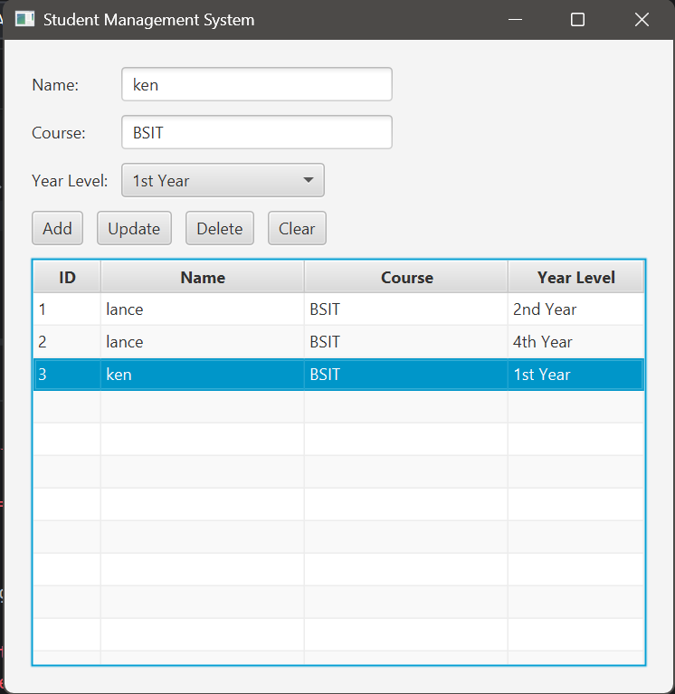
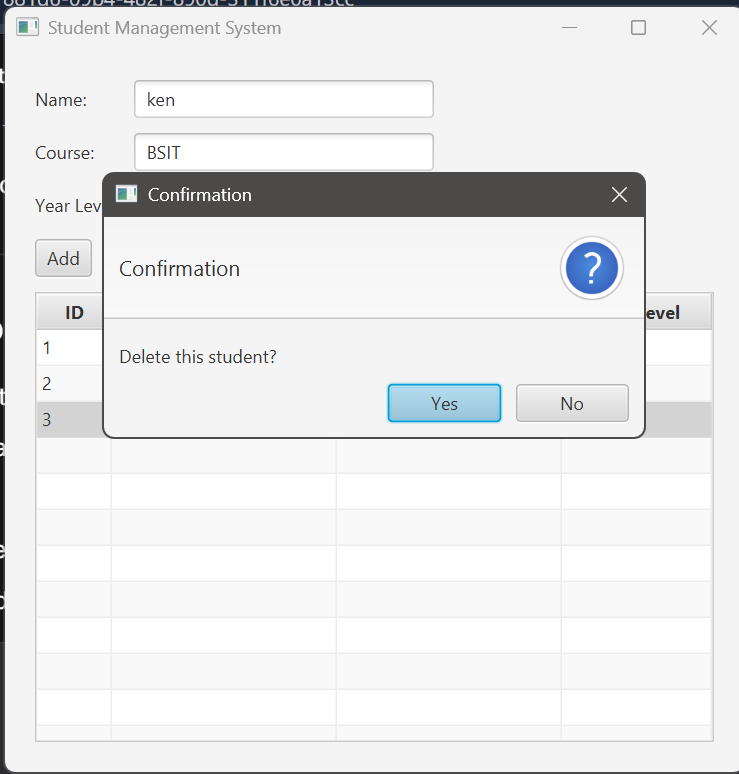
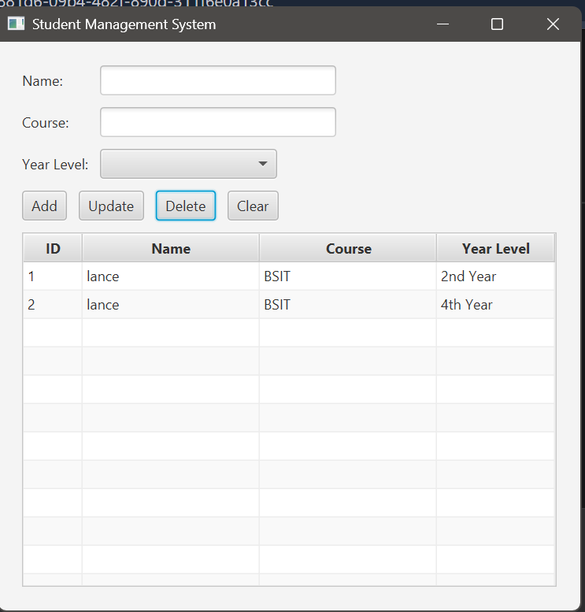

# Student Management System

A JavaFX + JDBC + PostgreSQL desktop application that performs basic CRUD (Create, Read, Update, Delete) operations for student records. Developed as a case study for integrating a graphical user interface with a relational database.

## Features

- **Add** new student records (name, course, year level)
- **View** all students in a TableView
- **Update** selected student details
- **Delete** a student record with confirmation dialog
- **Clear** input fields
- Input validation (no empty fields allowed)
- Uses **JavaFX** for UI, **JDBC** for database connectivity, and **PostgreSQL** as the database.

## Screenshots

*Proof of working CRUD operations*

### Add Student


### Delete Student (Confirmation Dialog)


### Before Update – Record (e.g., changing year level)


### Update Student (e.g., changing year level)


## Prerequisites

- Java 17 or higher (JDK)
- Maven 3.6+
- PostgreSQL (provided by professor)

## Setup Instructions

### 1. Clone or download the project

```bash
git clone https://github.com/your-username/student-management-system.git
cd student-management-system
```

### 2. Configure database connection  
Edit `src/main/java/com/example/jdbc/DBConnection.java` and set your PostgreSQL credentials

```java
private static final String PASSWORD = "your_postgres_password";
```

If needed, also update the URL, username, or host.

Alternatively, import the project into IntelliJ IDEA and run the `MainApp` class with the provided VM arguments.

## Usage

1. Launch the application.
2. Enter a student name, course, and select a year level.
3. Click **Add** to insert the record into the database.
4. Click any row in the table – the fields will populate with that student's data.
5. Modify the fields and click **Update** to save changes.
6. Select a row and click **Delete** – a confirmation dialog will appear.
7. Click **Clear** to reset the input form.

## Project Structure

## Technologies Used

- **JavaFX 21.0.6** – GUI framework
- **PostgreSQL 42.7.5** – JDBC driver
- **Maven** – Build and dependency management
- **IntelliJ IDEA** – Recommended IDE

## Troubleshooting

- **Cannot connect to PostgreSQL** – Make sure the PostgreSQL service is running and the connection parameters in `DBConnection.java` are correct 
- **JavaFX runtime components missing** – Always use `mvn clean javafx:run` or the provided IntelliJ run configuration (with VM options).
- **Table not showing data** – Verify that the `students` table already contains data (add via the **Add** button).

## Author

Danghil, Lance Henrik B.

## License

This project is for educational purposes only.
